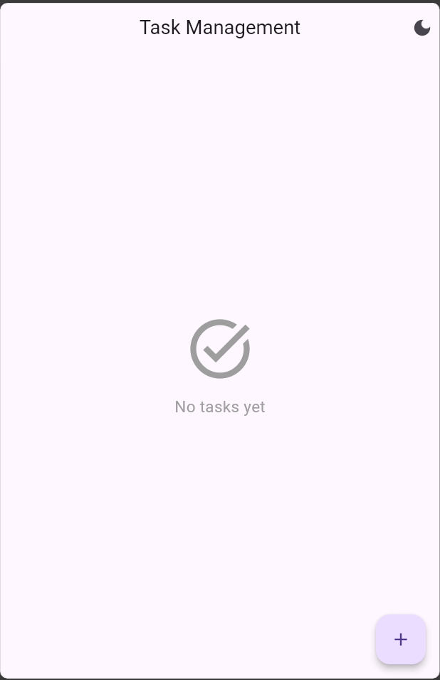
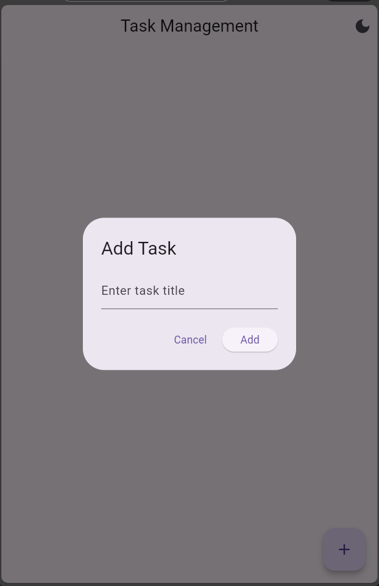
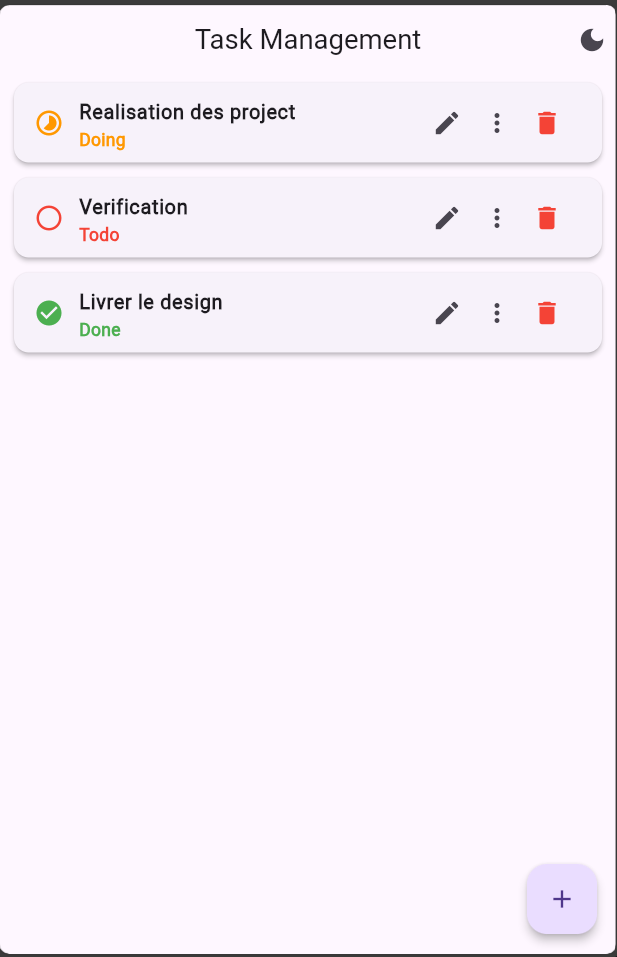
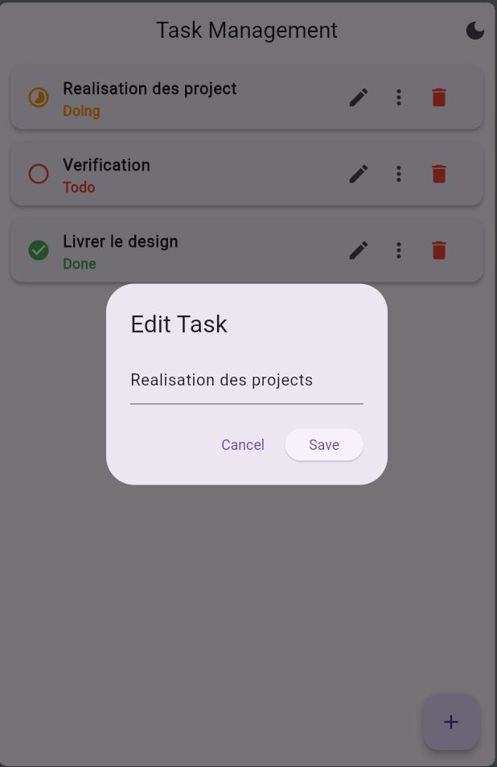
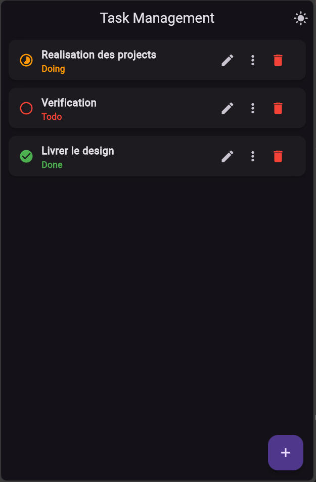

# 📝 Task Management App (Flutter)

A simple and clean **Task Management mobile application** built using **Flutter**.  
This project demonstrates CRUD operations, local data persistence, clean UI, and Dark Mode support.

---

## 🚀 Features

- ➕ Add new tasks
- ✏️ Edit tasks
- ❌ Delete tasks
- 🔄 Change task status (Todo / Doing / Done)
- 💾 Local storage using SharedPreferences
- 🌙 Light & Dark Mode (saved automatically)
- 🎨 Clean and modern UI

---

## 📱 Screenshots

### 🟢 Empty State

### ➕ Add Task

### 📋 Task List

### ✏️ Edit Task

### 🌙 Dark Mode

---

## 🛠️ Tech Stack

- **Flutter**
- **Dart**
- **SharedPreferences**
- Material Design

---

## 📂 Project Structure

lib/
├── models/
│ └── task.dart
├── services/
│ └── task_storage.dart
├── screens/
│ └── home_screen.dart
├── widgets/
│ └── task_item.dart
└── main.dart

---

## ▶️ Getting Started

### Prerequisites
- Flutter SDK installed
- Android Studio or VS Code
- Emulator or physical device

### Run the project

flutter pub get
flutter run
💡 What I Learned
Flutter widget architecture

State management using StatefulWidget

Local data persistence with SharedPreferences

UI/UX improvements

Dark Mode implementation

👨‍💻 Author
PUT YOUR NAME HERE
Junior Flutter Developer
GitHub: https://github.com/MOUNIM05

📄 License
This project is open source and available for learning purposes.

